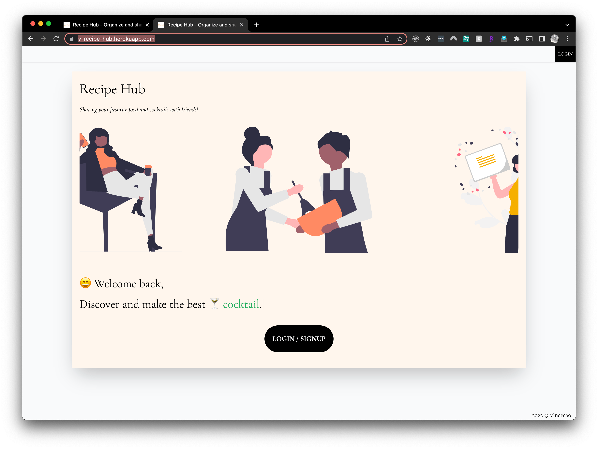
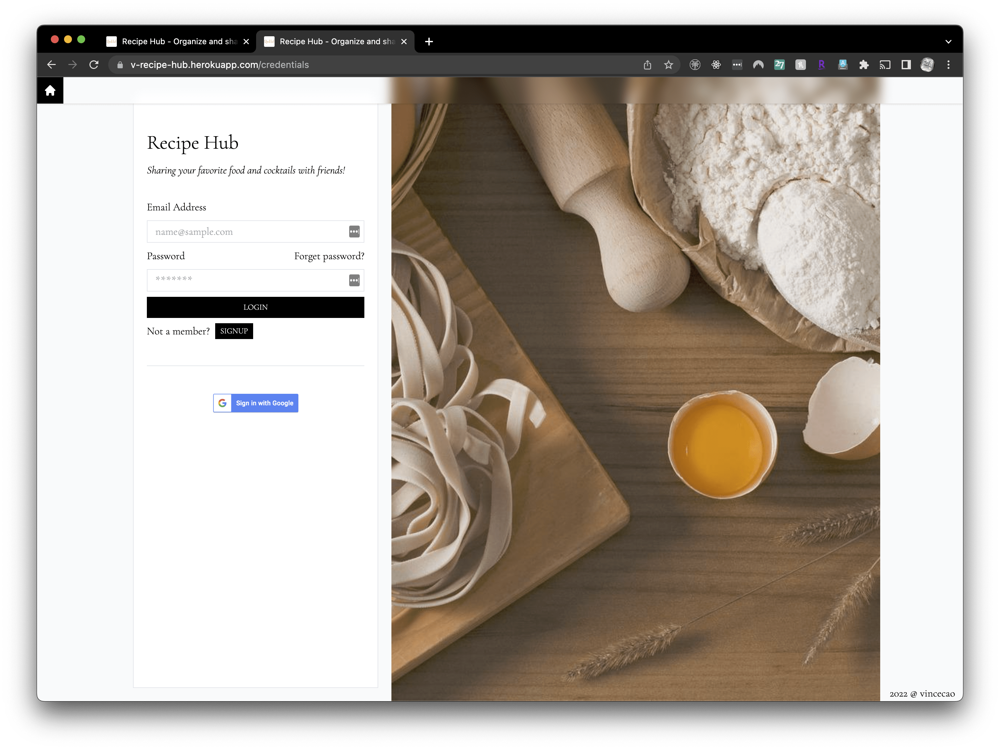
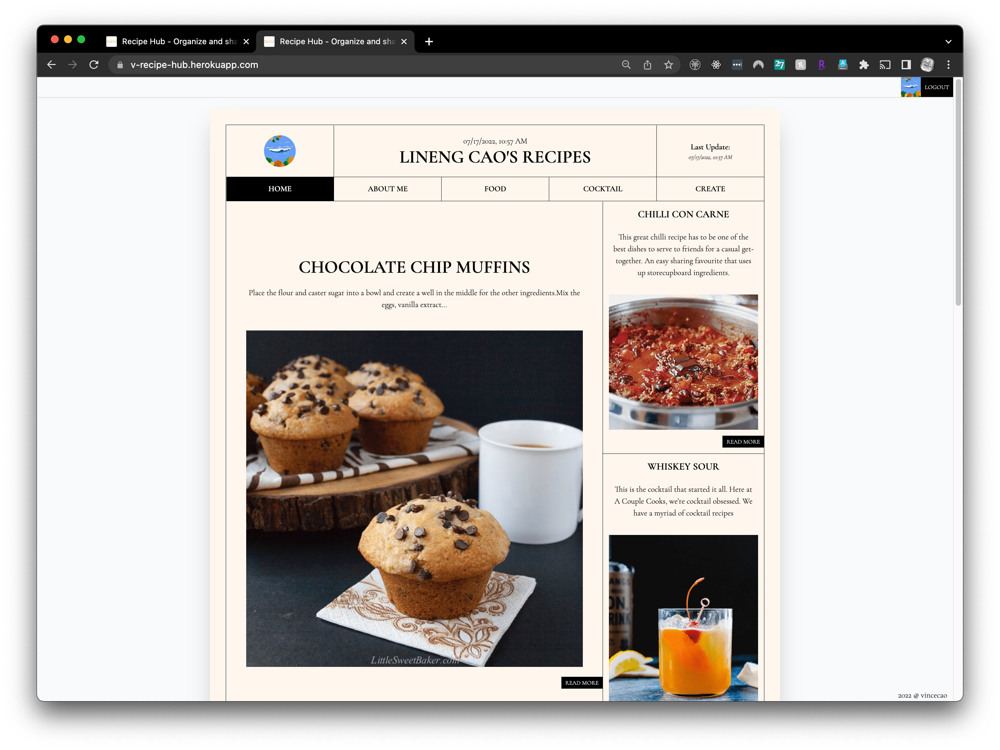
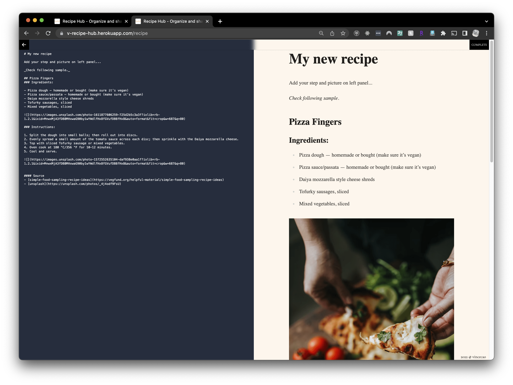
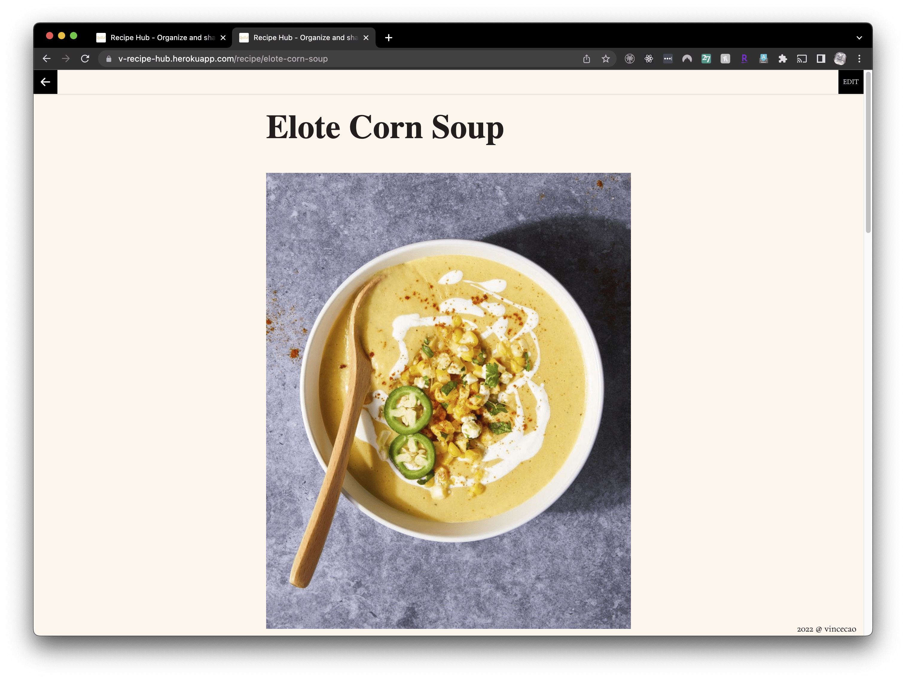

# Recipe Hub - Vue

<span style="display: flex; margin: 30px 0;">

</span>


[Recipe Hub](https://v-recipe-hub.herokuapp.com) is a prefect place to store and share your food, cocktail recipes in your daily life.

Build with Hybrid [Vue3](https://vuejs.org/) Framework [Nuxt3](https://v3.nuxtjs.org/), linked the authentication and realtime database from [Firebase](https://firebase.google.com), styled with [Tailwindcss](https://tailwindcss.com/) and hosted on [Heroku](https://www.heroku.com). This project is also utilizing Firebase Functions (folder [/functions](./functions/)) to work as an [Apollo GraphQL Server](https://www.apollographql.com/docs/apollo-server/) for achieving endpoint queries and mutations.

The app uses sample recipes from online resources with references and open-source illustrations from [Undraw](https://undraw.co) and [Pixabay](https://pixabay.com).

_Desktop_






_Mobile_


# Development

## Firebase
```bash
# localhost with production realtime database
yarn preview:production

# fix eslint warning
yarn lint --fix

# deploy firebase function to Google Cloud
yarn deploy
```
## Nuxt3
```bash
# install dependencies
yarn

# add .env file follows .env.sample

# local start server
yarn dev

# local build node server resources
yarn build

# local generate static files
yarn generate
```

# license
MIT